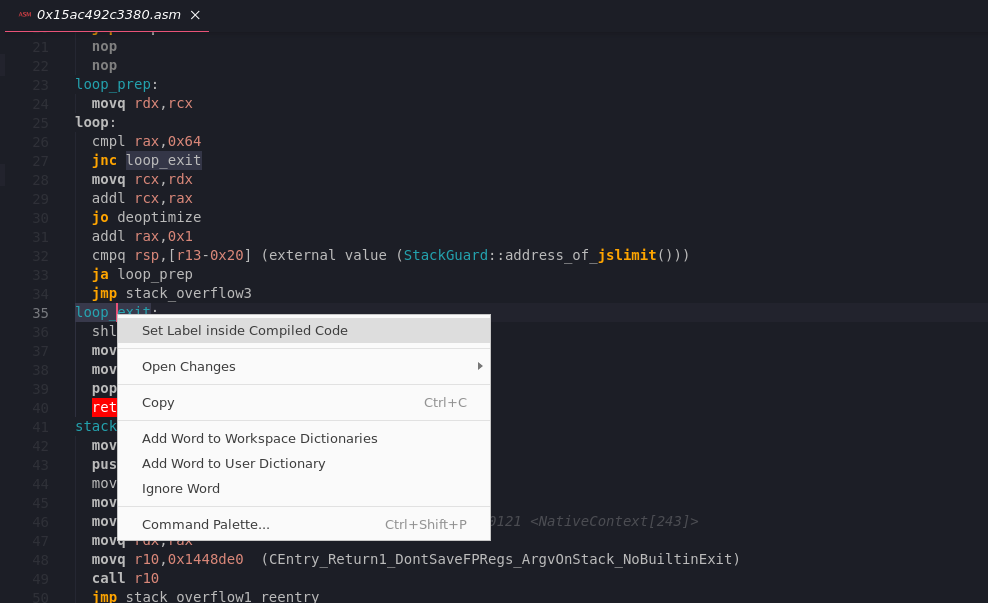

# VSCode V8 Insights

**This only works reliably with NodeJS v14!**

Sometimes when benchmarking JavaScript I ask myself _How can this be that fast?_ ...

Although V8 has rich debug logging, finding the right logs is really a challenge. 
Thus I wrote this plugin which - slightly inspired by the 'deoptigate' plugin - indexes the V8 logs and displays them next to the JavaScript code. 

**Instrument -** To use this extension with NodeJS, `node` needs to be run using the correct flags to turn on debug logging. 
To launch an existing npm command listed in package.json with the correct commands, 
 run CTRL + SHIFT + P _V8 Insights Run NPM command with instrumentation_. 
Alternatively open a self-containing JavaScript file (or the entrypoint of a module) and right-click _V8 Insights Run File with instrumentation_. 
Afterwards V8 will write a lot of logs inside the .vs-insights directory.

**Analyze -** Once the application got warm or finished running, the logs can be analyzed and grouped by function. 
To trigger this either right-click _V8 Insights Analyze and Start_ or run the same from the command palette. 

**Inspect -** When opening a JavaScript file, functions will be annotated with whether they were optimized or deoptimized, 
 also the compile time is shown. One can navigate to a function history, detailing all the events of the function, 
 or also view the compiled code in Assembly. The Assembly Editor automatically inserts labels for jump targets, which can be renamed through right-click. 
 It also has some basic syntax highlighting, though installing another extension for x86 Assembly syntax support is recommended. 

 

**Cleanup -** To delete the .vs-insights logs, run the command _V8 Insights Cleanup_ from the command palette
